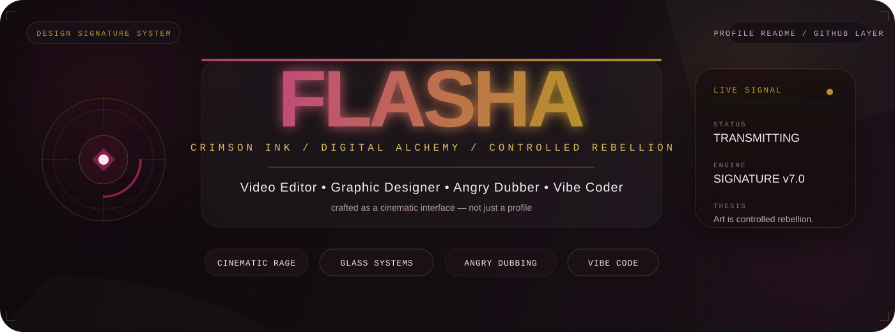
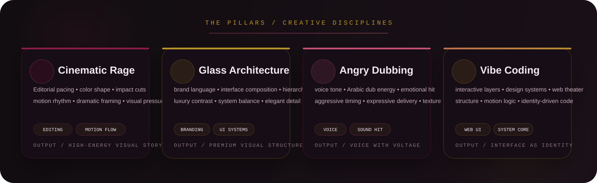
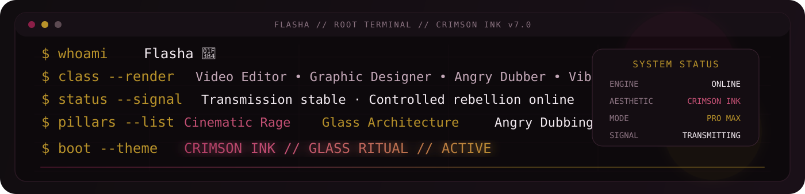

  

  
  
  

  
  
  

---

## SIGNAL PROFILE

**Flasha 🎴**  
Video Editor • Graphic Designer • Angry Dubber • Vibe Coder

> Digital alchemy through cinematic rage, glass architecture, and controlled rebellion.

  

  

---

## TRANSMISSION MATRIX

  
  

  
  

  

---

## ARSENAL

  
  
  
  

  
  
  
  
  
  

---

## THE ARCHIVE

  
  
  
  
  
  

  

