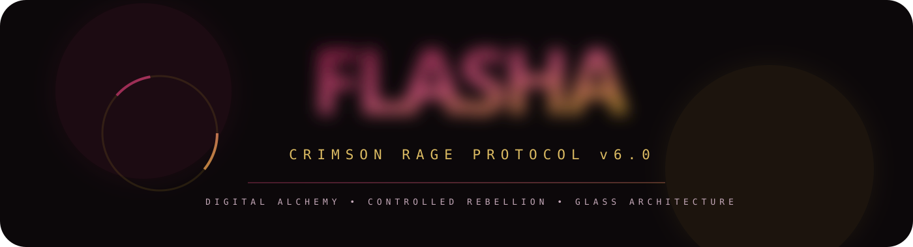

  

  
  
  
  
  
  

  

---

## ⬡ The Vessels

<table>
  <tr>
    <td align="center" width="25%">
       
      <b>Cinematic Rage</b> 
      Video Editing
    </td>
    <td align="center" width="25%">
       
      <b>Glass Architecture</b> 
      Graphic Design
    </td>
    <td align="center" width="25%">
       
      <b>Angry Dubbing</b> 
      Voice Over
    </td>
    <td align="center" width="25%">
       
      <b>Vibe Coding</b> 
      Web & Systems
    </td>
  </tr>
</table>

---

## ◈ Live Transmission

  
  

  

---

## ◈ Activity Graph

  

---

  

